# 实验2

## 实验目的： 

-   练习输入、输出

-   练习控制结构

## 实验要求： 

-   按照题目要求写代码，撰写实验报告，并在下周实验课上课前提交到FTP。

## 实验题目：

题目1：请编写程序，在程序中提示用户输入字符串、整数、布尔类型的值，然后分别以三种不同方式将用户的输入输出。

提示：输出的三种方式可分别用print(),println(),printf()三个方法。

题目2：请按照游戏规则和要求编程。

-   博饼游戏规则如下图所示。

    -   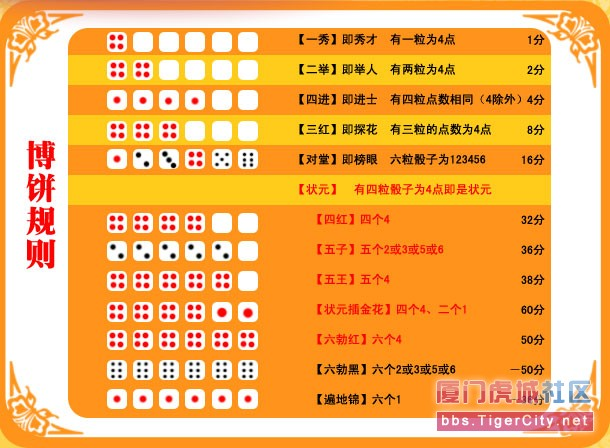
        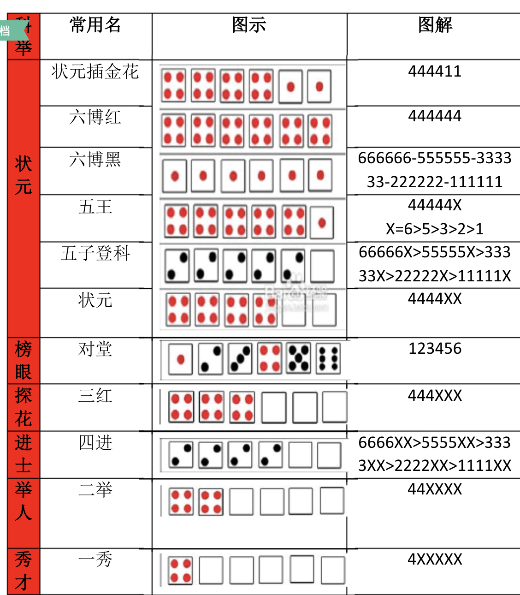

    -   

| **奖项**  | **份数** |
|-----------|----------|
| 状元      | 1        |
| 对堂      | 2        |
| 三红      | 4        |
| 四进      | 8        |
| 二举      | 16       |
| 一秀      | 32       |

-   

-   要求：

1.  功能：

    模拟博饼游戏：

2.  提醒用户输入玩家数（6-10）。

3.  循环为每个玩家生成六个筛子点数（1-6），根据上图的规则判断所产生的骰子对应的奖项，并输出。

4.  游戏结束时（所有奖项已经出完），输出每个玩家所获得的奖项以及每个奖项的个数。

5.  要求预留测试接口以便测试程序。

6.  需要考虑一次产生多个奖项的情况，如：四进带一秀。

## 辅助说明：

-   使用Random类或SecureRandom类产生随机数 Math.random()

# 实验3

## 实验目的：

-   练习控制结构

-   熟悉简单的枚举

-   熟悉简单的JavaFX图形界面

## 实验要求： 

-   下周前二前将工程文档和实验报告打包上传到FTP

## 实验题目：

1.  基本题目：

2.  (Prime Numbers) A positive integer is prime if it’s divisible by only 1 and
    itself. For example, 2, 3, 5 and 7 are prime, but 4, 6, 8 and 9 are not. The
    number 1, by definition, is not prime.

3.  Write a method that determines whether a number is prime.

4.  Use this method in an application that determines and displays all the prime
    numbers less than 10,000. How many numbers up to 10,000 do you have to test
    to ensure that you’ve found all the primes?

5.  Initially, you might think that n/2 is the upper limit for which you must
    test to see whether a number n is prime, but you need only go as high as the
    square root of n. Rewrite the program, and run it both ways.

6.  (Coin Tossing) Write an application that simulates coin tossing. Let the
    program toss a coin each time the user chooses the “Toss Coin” menu option.
    Count the number of times each side of the coin appears. Display the
    results. The program should call a separate method flip that takes no
    arguments and returns a value from a Coin **enum** (HEADS and TAILS). [Note:
    If the program realistically simulates coin tossing, each side of the coin
    should appear approximately half the time.]

7.  （Random 2D Dynamic Art with Canvas) write an app that continuously draws 10
    Circles on a Canvas. Use random positions, sizes.

1.  扩展题目（选做）:

2.  (6.35 Computer-Assisted Instruction) The use of computers in education is
    referred to as computer-assisted instruction (CAI). Write a program that
    will help an elementary school student learn multiplication. Use a
    SecureRandom object to produce two positive one-digit integers. The program
    should then prompt the user with a question, such as

    

    The student then inputs the answer. Next, the program checks the student’s
    answer. If it’s correct, display the message "Very good!" and ask another
    multiplication question. If the answer is wrong, display the message "No.
    Please try again." and let the student try the same question repeatedly
    until the student finally gets it right. A separate method should be used to
    generate each new question. This method should be called once when the
    application begins execution and each time the user answers the question
    correctly.

3.  (6.36 Computer-Assisted Instruction: Reducing Student Fatigue) One problem
    in CAI environments is student fatigue. This can be reduced by varying the
    computer’s responses to hold the student’s attention. Modify the program of
    Exercise 6.35 so that various comments are displayed for each answer as
    follows:

    Possible responses to a correct answer:

    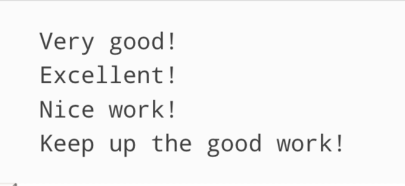

    Possible responses to an incorrect answer:

    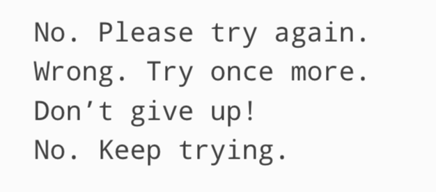

    Use random-number generation to choose a number from 1 to 4 that will be
    used to select one of the four appropriate responses to each correct or
    incorrect answer. Use a switch statement to issue the responses.

4.  (6.37 Computer-Assisted Instruction: Monitoring Student Performance) More
    sophisticated computer-assisted instruction systems monitor the student’s
    performance over a period of time. The decision to begin a new topic is
    often based on the student’s success with previous topics. Modify the
    program of Exercise 6.36 to count the number of correct and incorrect
    responses typed by the student. After the student types 10 answers, your
    program should calculate the percentage that are correct. If the percentage
    is lower than 75%, display "Please ask your teacher for extra help.", then
    reset the program so another student can try it. If the percentage is 75% or
    higher, display "Congratulations, you are ready to go to the next level!",
    then reset the program so another student can try it.
    

# 实验4

## 实验目的： 

-   熟悉数组的使用

-   简单的JavaFX

## 实验要求： 

-   下周前二前将工程文档和实验报告打包上传到FTP实验题目：

**一、基本题目**

1． *(Game of Craps)* Write an application that runs 1,000,000 games of craps
and answers the following questions:

-   a) How many games are won on the first roll, second roll, ..., twentieth
    roll and after the twentieth roll?

-   b) How many games are lost on the first roll, second roll, ..., twentieth
    roll and after the twentieth roll?

-   c) What are the chances of winning at craps? [*Note:* You should discover
    that craps is one of the fairest casino games. What do you suppose this
    means?]

-   d) What is the average length of a game of craps?

-   e) Do the chances of winning improve with the length of the game?

2\. *(Airline Reservations System)* A small airline has just purchased a computer
for its new automated reservations system. You’ve been asked to develop the new
system. You’re to write an application to assign seats on each flight of the
airline’s only plane (capacity: 10 seats).

Your application should display the following alternatives: Please type 1 for
First Class and Please type 2 for Economy. If the user types 1, your application
should assign a seat in the first- class section (seats 1–5). If the user types
2, your application should assign a seat in the economy section (seats 6–10).
Your application should then display a boarding pass indicating the person’s
seat number and whether it’s in the first-class or economy section of the plane.

Use a one-dimensional array of primitive type boolean to represent the seating
chart of the plane. Initialize all the elements of the array to false to
indicate that all the seats are empty. As each seat is assigned, set the
corresponding element of the array to true to indicate that the seat is no
longer available.

Your application should never assign a seat that has already been assigned. When
the economy section is full, your application should ask the person if it’s
acceptable to be placed in the first-class section (and vice versa). If yes,
make the appropriate seat assignment. If no, display the message "Next flight
leaves in 3 hours."

3\. *(Turtle Graphics)* The Logo language made the concept of *turtle graphics*
famous. Imagine a mechanical turtle that walks around the room under the control
of a Java application. The turtle holds a pen in one of two positions, up or
down. While the pen is down, the turtle traces out shapes as it moves, and while
the pen is up, the turtle moves about freely without writing anything. In this
problem, you’ll simulate the operation of the turtle and create a computerized
sketchpad.

Use a 20-by-20 array floor that’s initialized to zeros. Read commands from an
array that contains them. Keep track of the current position of the turtle at
all times and whether the pen is currently up or down. Assume that the turtle
always starts at position (0, 0) of the floor with its pen up. The set of turtle
commands your application must process are shown in Fig. 7.29.

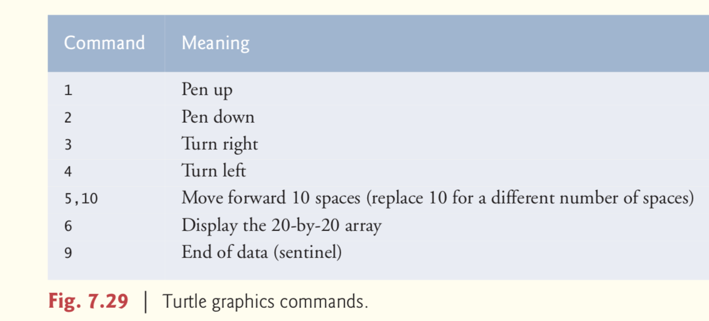

Suppose that the turtle is somewhere near the center of the floor. The following
“program”

would draw and display a 12-by-12 square, leaving the pen in the up position:

2

5,12

3

5,12

3

5,12

3

5,12

1

6

9

As the turtle moves with the pen down, set the appropriate elements of array
floor to 1s. When the 6 command (display the array) is given, wherever there’s a
1 in the array, display an asterisk or any character you choose. Wherever
there’s a 0, display a blank.

Write an application to implement the turtle graphics capabilities discussed
here. Write several turtle graphics programs to draw interesting shapes. Add
other commands to increase the power of your turtle graphics language.

4\. *(Enhancing Class Time2)* Modify class Time2 to include a tick method that
increments the time stored in a Time2 object by one second. Provide method
incrementMinute to increment the minute by one and method incrementHour to
increment the hour by one. Write a program that tests the tick method, the
incrementMinute method and the incrementHour method to ensure that they work
correctly. Be sure to test the following cases:

-   a) incrementing into the next minute,

-   b) incrementing into the next hour and

-   c) incrementing into the next day (i.e., 11:59:59 PM to 12:00:00 AM).

5\. (Addition App) Create a JavaFX version of the addition program. Use two
TextFields to receive the user’s input and a Button to initiate the calculation.
Display the results in a Label. Since TextField method getText returns a String,
you must convert the String the user enters to an int for use in calculations.
Recall that the static method parseInt of class Integer takes a String argument
representing an integer and returns the value as an int.

**二、 扩展题目**

1\. (7.30 Card Shuffling and Dealing) Modify Fig. 7.11 to deal a five-card poker
hand. Then modify class DeckOfCards of Fig. 7.10 to include methods that
determine whether a hand contains

1.  a pair（一对 5张中2张的数字一样，另外3张歌不相同）

2.  two pairs（两对 4张中两两数字一样，余下1张不同）

3.  three of a kind(e.g., three jacks 三条 5张中3张的数字一样)

4.  four of a kind(e.g.,four aces四条)

5.  a flush(i.e.,all five cards of the same suit,同花 五张花色一样)

6.  a straight(i.e.,five cards of consecutive face values，顺子 五张数字相连)

7.  a full house(i.e., two cards of one face value and three cards of another
    face value 葫芦3张数字一样，另外2张数字一样)

https://baijiahao.baidu.com/s?id=1694625679352555083&wfr=spider&for=pc

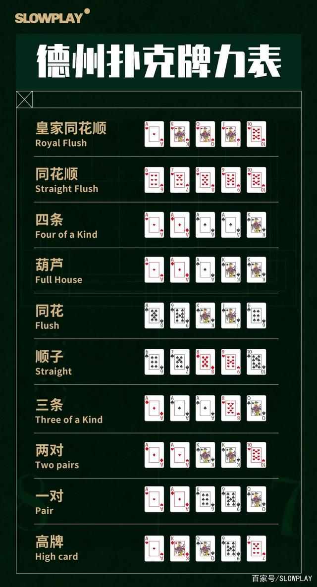

2\. (7.31 Card Shuffling and Dealing) Use the methods developed in Exercise 7.30
to write an application that deals two five-card poker hands, evaluates each
hand and determines which is better.

3\. (7.32 Project: Card Shuffling and Dealing) Modify the application developed
in Exercise 7.31 so that it can simulate the dealer. The dealer’s five-card hand
is dealt “face down,” so the player cannot see it. The application should then
evaluate the dealer’s hand, and, based on the quality of the hand, the dealer
should draw one, two or three more cards to replace the corresponding number of
unneeded cards in the original hand. The application should then reevaluate the
dealer’s hand. [Caution: This is a difficult problem!]

4\. (Project: Card Shuffling and Dealing) Modify the application developed in
Exercise 7.32 so that it can handle the dealer’s hand automatically, but the
player is allowed to decide which cards of the player’s hand to replace. The
application should then evaluate both hands and determine who wins. Now use this
new application to play 20 games against the computer. Who wins more games, you
or the computer? Have a friend play 20 games against the computer. Who wins more
games? Based on the results of these games, refine your poker-playing
application. (This, too, is a difficult problem.) Play 20 more games. Does your
modified application play a better game?

5.(Project: Card Shuffling and Dealing) Modify the application of Figs. 7.9
–7.11 to use Face and Suit enum types to represent the faces and suits of the
cards. Declare each of these enum types as a public type in its own source-code
file. Each Card should have a Face and a Suit instance variable. These should be
initialized by the Card constructor. In class DeckOfCards, create an array of
Faces that’s initialized with the names of the constants in the Face enum type
and an array of Suits that’s initialized with the names of the constants in the
Suit enum type. [Note: When you output an enum constant as a String, the name of
the constant is displayed.]

# 实验5

## 实验目的：

-   熟悉枚举

-   熟悉继承

-   了解多态

## 实验要求： 

-   按照题目要求写代码和实验报告，并上传到FTP

## 实验题目：

1.  基本题目：

2.  (Rational Numbers) Create a class called **Rational** for performing
    arithmetic with fractions. Write a program to test your class. Use integer
    variables to represent the private instance variables of the class the
    numerator(分子) and the denominator（分母）. Provide a constructor that
    enables an object of this class to be initialized when it is declared. The
    constructor should store the fraction in reduced form(简化形式). The
    fraction

2/4

is equivalent to 1/2 and would be stored in the object as 1 in the numerator and
2 in the denominator. Provide a no-argument constructor with default values in
case no initializers are provided. Provide public methods that perform each of
the following operations:

1.  Add two Rational numbers: The result of the addition should be stored in
    reduced form.

2.  Subtract two Rational numbers: The result of the subtraction should be
    stored in reduced form.

3.  Multiply two Rational numbers: The result of the multiplication should be
    stored in reduced form.

4.  Divide two Rational numbers: The result of the division should be stored in
    reduced form.

5.  Print Rational numbers in the form a/b, where a is the numerator and b is
    the denominator.

6.  Print Rational numbers in floating-point format. (Consider providing
    formatting capabilities that enable the user of the class to specify the
    number of digits of precision to the right of the decimal point.)

-   提示：

    -   有理数是有分子、分母以形式a/b表示的数，其中a是分子，b是分母。例如，1/3，3/4，10/4。

    -   有理数的分母不能为0，分子却可以为0。每个整数a等价于有理数a/1。有理数用于分数的精确计算中。例如1/3=0.0000…，它不能使用数据类型double或float的浮点格式精确表示出来，为了得到准确结果，必须使用有理数。

    -   Java提供了整数和浮点数的数据类型，但是没有提供有理数的类型。

    -   由于有理数与整数、浮点数有许多共同特征，并且Number类是数字包装的根类，因此，把有理数类Rational定义为Number类的一个子类是比较合适的。由于有理数是可比较的，那么Rational类也应该实现Comparable接口。+下页图中描述了Rational类已将其与Number类和Comparable接口的关系。

        -   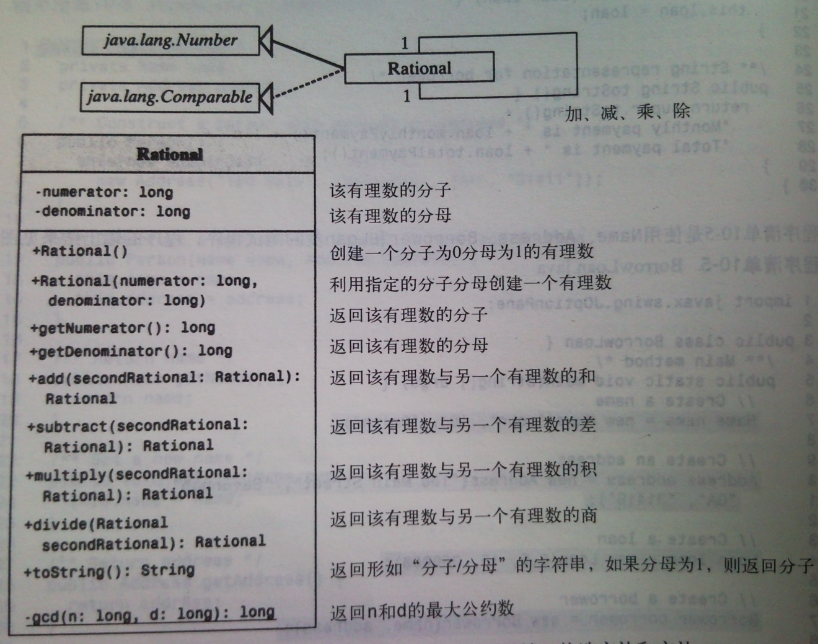

1.  创建一个简单的绘图应用程序，要求如下：

2.  随机产生一个随机数（0,1,2），三个随机数分别对应直线、矩形和椭圆三种图形。根据随机数对应图形，提示用户输入图形所需初始化参数，提示信息应包括参数的范围，用户输入后进行范围检查，若合法，则根据用户输入的信息在界面上绘制出相应的图形。

3.  绘制20个图形后，不再创建新的图形。

4.  将所做程序导出为可执行的Jar文件。

5.  写一个表示月份的枚举类Month，其中值是月份的英文缩写，如一月表示为Jan。用户可以通过这个类获得月份的全称，如一月的全称January。写一个测试类，输出通过Month得到的所有月份的缩写和全称。

6.  (Recommended: Using Composition Rather Than Inheritance) Many programs
    written with inheritance could be written with composition instead, and vice
    versa. Rewrite class BasePlus–CommissionEmployee (Fig. 9.11) of the
    CommissionEmployee–BasePlusCommissionEmployee hierarchy so that it contains
    a reference to a CommissionEmployee object, rather than inheriting from
    class CommissionEmployee. Retest BasePlusCommissionEmployee to demonstrate
    that it still provides the same functionality.

7.  扩展题目（选做）:

8.  我们有一些图形的边长数据，这些图形包括三角新和矩形，请你编写一个程序求出它们的面积。

请你实现一个基础图形类Graph，然后实现三角形类Triangle和矩形类Rectangle，继承自Graph。根据输入的边数实现不同的对象，并计算面积。

输入格式：

一行，一个整数n，表示图形个数。

n行，每行是用空格隔开的整数。

输出格式：

n行，每行是一个图形的面积。

输入样例：

2

5 5

6 6 6

输出样例：

25

15

# 实验7

## 实验目的： 

-   

-   熟悉异常处理

## 实验要求： 

-   按照题目要求写代码，并在下周二上课前将相关文件提交到ftp

## 实验题目：

## 一、基本题目

### 题目1

(Payroll System Modification) Modify the payroll system of Figs. 10.4–10.9 to
include an additional Employee subclass **PieceWorker** that represents an
employee whose pay is based on the number of pieces of merchandise produced.
Class PieceWorker should contain private instance variables **wage** (to store
the employee’s wage per piece) and **pieces** (to store the number of pieces
produced). Provide a concrete implementation of method **earnings** in class
PieceWorker that calculates the employee’s earnings by multiplying the number of
pieces produced by the wage per piece. Create an array of Employee variables to
store references to objects of each concrete class in the new Employee
hierarchy. For each Employee, display its String representation and earnings.

### 题目2:

(Accounts Payable System Modification) In this exercise, we modify the accounts
payable application of Figs.10.11–10.14 to include the complete functionality of
the payroll application of Figs. 10.4–10.9. The application should still process
**two Invoice objects**, but now should process one object of each of the **four
Employee subclasses**. If the object currently being processed is a
Base-PlusCommissionEmployee, the application should **increase the
BasePlusCommissionEmployee’s basesalary by 10%**. Finally, the application
should **output the payment amount for each object.** Complete the following
steps to create the new application:

1\. Modify classes HourlyEmployee (Fig. 10.6 ) and CommissionEmployee (Fig. 10.7
) to place them in the Payable hierarchy as subclasses of the version of
Employee (Fig. 10.13 ) that implements Payable. [Hint:Change the name of method
earnings to getPaymentAmount in each subclass so that the class satisfies its
inherited contract with interface Payable.]

2．Modify class BasePlusCommissionEmployee (Fig. 10.8) such that it extends the
version of class CommissionEmployee created in part (a).

3\. Modify PayableInterfaceTest (Fig. 10.14 ) to polymorphically process two
Invoices, one SalariedEmployee, one HourlyEmployee, one CommissionEmployee and
one BasePlusCommissionEmployee. First output a String representation of each
Payable object. Next, if an object is a BasePlusCommissionEmployee, increase its
basesalary by 10%. Finally, output the payment amount for each Payable object

### 题目3:

 (CarbonFootprint Interface: Polymorphism) Using interfaces, as you learned in
this chapter, you can specify similar behaviors for possibly disparate classes.
Governments and companies worldwide are becoming increasingly concerned with
carbon footprints (annual releases of carbon dioxide into the atmosphere) from
buildings burning various types of fuels for heat, vehicles burning fuels for
power, and the like. Many scientists blame these greenhouse gases for the
phenomenon called global warming. Create three small classes unrelated by
inheritance classes **Building**, **Car** and **Bicycle**. Give each class some
unique appropriate attributes and behaviors that it does not have in common with
other classes. Write an **interface CarbonFootprint** with a
**getCarbonFootprint** method. Have each of your classes implement that
interface, so that its getCarbonFootprint method calculates an appropriate
carbon footprint for that class (check out a few websites that explain how to
calculate carbon footprints). Write an application that creates objects of each
of the three classes, places references to those objects in
**ArrayList\<CarbonFootprint\>**, then iterates through the ArrayList,
polymorphically invoking each object’s getCarbonFootprint method. For each
object, print some identifying information and the object’s carbon footprint.

### 题目4

自定义异常的定义、拋出和捕获：

(1)
自定义两个异常类：非法姓名异常IllegaNameException和非法地址异常IllegalAddressException。

(2)
定义Student类包含name和address属性，和setName、setAddress方法，当姓名长度小于1或者大于5时抛出IllegaNameException，当地址中不含有“省”或者“市”关键字时抛出IllegalAddressException。

(3) 编写程序抛出这两种异常，在main方法中进行捕获并合理地处理。

### 题目5：

(Rethrowing Exceptions) Write a program that illustrates rethrowing an
exception. Define methods *someMethod* and *someMethod2*. Method *someMethod2*
should initially throw an exception. Method *someMethod* should call
*someMethod2*, catch the exception and rethrow it. Call *someMethod* from method
*main*, and catch the rethrown exception. Print the stack trace of this
exception.

### 题目6：

完善上周的模拟考试题目，补充必要的异常处理。

# 实验8

## 实验目的： 

-   熟悉JavaFX（一）

## 实验要求： 

-   按照题目要求写代码和实验报告，并上传到ftp

## 实验题目：

## 一、基本题目

### 题目1

**(Enhanced Tip Calculator App)** Modify the Tip Calculator app to allow the
user to enter the number of people in the party. Calculate and display the
amount owed by each person if the bill were to be split evenly among the party
members.

### 题目2：

**** (Car Payment Calculator App) Typically, banks offer car loans for periods
ranging from two to five years (24 to 60 months). Borrowers repay the loans in
monthly installments. The amount of each monthly payment is based on the length
of the loan, the amount borrowed and the interest rate. Create an app that
allows the customer to enter the price of a car, the down-payment amount and the
loan’s annual interest rate. The app should display the loan’s duration in
months and the monthly payments for two-, three-, four- and five-year loans. The
variety of options allows the user to easily compare repayment plans and choose
the most appropriate.

### 题目3：

学习各种对话框的实现方法，熟悉每一种对话框的实现。

<https://blog.csdn.net/u013760453/article/details/78980637>

# 实验9

## 实验目的：

-   熟悉JavaFX

## 实验要求： 

-   按照题目要求写代码和实验报告，并上传到FTP

## 实验题目：

1.  基本题目：

    1 2只需要设计界面，不需要写代码

2.  设计界面：

    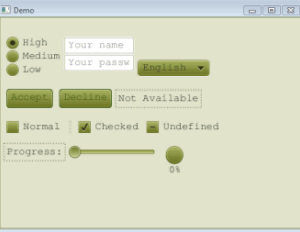

3.  设计界面：（图片任选）

    

4.  在painter例子基础上修改，让程序可以绘制矩形、圆形、直线，并且可以通过对话框修改颜色（可以参考例子Color
    Chooser）。

5.  实现以下界面效果（请自行查资料了解TabPane）：

    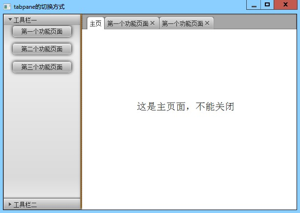

6.  扩展题目（选做）:

7.  实现一个注册框，让用户输入用户名、密码、确认密码，其中用户名长度不能小于4，两次密码必须相同。若输入不满足要求，当用户点击“确定”按钮时，提示相应错误。

8.  使用3个Slider来编辑图片的渲染效果。每个Slider会调整一个特定的视觉效果：不透明度（Opacity）、棕褐色调值（Sepia
    Tone）、缩放因子（Scaling Factor）。（图片任选）

>   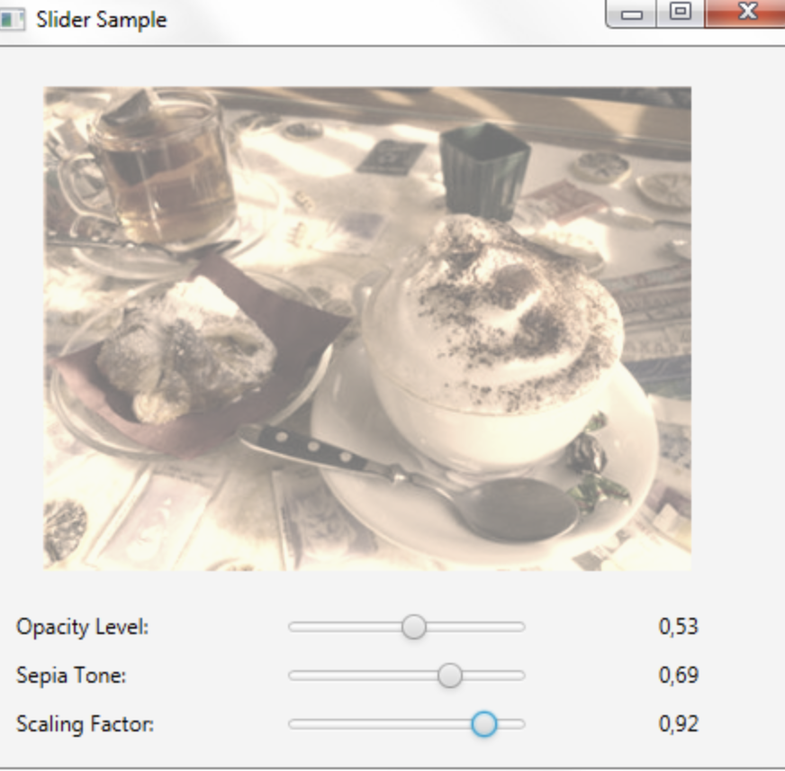

# 实验10

## 实验目的： 

-   熟悉字符串及规则表达式

## 实验要求： 

-   按照题目要求写代码和实验报告，除了题目4外，其它题目须于5月11日上课前上传到ftp.

## 实验题目：

## 一、基本题目

### 题目1

输出以下新闻片段中所有出现的单词（每个单词只输出一次）。

### 题目2：

对用户输入的用户名、密码、邮箱进行判断，若不满足输入要求则提示出错类型。

用户名要求：不能为空，只能由字母、数字和\_组成，第一位不能为数字。

密码要求：不能为空，密码长度至少8位，由字母、数字、下划线组成。

邮箱要求：不能为空，需包含”@”符号。”@”符号后需要出现多个由”. ”分割的词。

### 题目3：

*(Tokenizing Telephone Numbers)* Write an application that inputs a telephone
number as a string in the form (555) 555-5555. The application should String
method split to extract the area code as a token, the first three digits of the
phone number as a token and the last four digits of the phone number as a token.
The seven digits of the phone number should be concatenated into one string.
Both the area code and the phone number should be printed. Remember that you’ll
have to change delimiter characters during the tokenization process.

### 题目4：（二选一，每个同学都要检查,若同学有自选题目，老师同意后也可以）

1.  仿照windows的记事本写一个自己的记事本程序。（要求：界面用JavaFX实现）

2.  仿照windows的画图工具写一个自己的画图程序。（要求：界面用JavaFX实现）

# 实验11

## 实验目的：

-   熟悉文件处理

## 实验要求： 

-   按照题目要求写代码和实验报告，并将相关文件上传FTP。

## 实验题目：

1.  基本题目：

2.  设计图形用户界面，提供新增、删除、修改、查询、显示按钮，分别完成以下功能：

    新增：让用户能输入学生的信息（学号、姓名、电话、邮箱信息），检查无误后将数据存入文本文件；

    删除：删除正在显示的学生信息；

    修改：修改正在显示的一条学生信息，修改后可保存至文本文件；

    查询：让用户输入姓名，一条条显示查询到的学生信息（借助“下一条”、“上一条”按钮查看下一条和上一条数据）。

    显示：显示文件中存储的所有学生信息（借助“下一条”、“上一条”按钮查看下一条和上一条数据）。

3.  修改以上程序，将信息存储在xml文件中（其它功能不变）

4.  修改以上程序，将信息存储在Excel文件中

1.  扩展题目：

2.  扩展阅读 <http://ifeve.com/overview/>。写一个注册多个channel读写文件的程序。

    。

# 实验12

## 实验目的：

-   熟悉泛型集合类

## 实验要求： 

-   按照题目要求写代码，并将工程文档压缩文件和实验报告上传到FTP

## 实验题目：

1.  基本题目：

2.  编写一个程序，从用户选择的一个文件（英文），统计这个文件中所有出现的英文单词以及次数，并按照出现次数排序输出。

3.  (Bubble Sort) Implement bubble sort—another simple yet inefficient sorting
    technique. It’s called bubble sort or sinking sort because smaller values
    gradually “bubble” their way to the top of the array (i.e., toward the first
    element) like air bubbles rising in water, while the larger values sink to
    the bottom (end) of the array. The technique uses nested loops to make
    several passes through the array. Each pass compares successive pairs of
    elements. If a pair is in increasing order (or the values are equal), the
    bubble sort leaves the values as they are. If a pair is in decreasing order,
    the bubble sort swaps their values in the array. The first pass compares the
    first two elements of the array and swaps their values if necessary. It then
    compares the second and third elements in the array. The end of this pass
    compares the last two elements in the array and swaps them if necessary.
    After one pass, the largest element will be in the last index. After two
    passes, the largest two elements will be in the last two indices. Explain
    why bubble sort is an O(n2) algorithm.

4.  (Counting Duplicate Words) Write a program that determines and prints the
    number of duplicate words in a sentence. Treat uppercase and lowercase
    letters the same. Ignore punctuation.

5.  (Sorting Words with a TreeSet) Write a program that uses a String method
    split to tokenize a line of text input by the user and places each token in
    a TreeSet. Print the elements of the TreeSet. [Note: This should cause the
    elements to be printed in ascending sorted order.]

6.  实现1-10数字以下运算：

    1.  每个数字\*4

    2.  筛选出3的倍数，保留；其它数字删除

    3.  将结果拼接为一个字符串，并输出

# 实验13

## 实验目的：

-   熟悉Lambda表达式

-   熟悉泛型方法和泛型类

-   熟悉多媒体编程

## 实验要求： 

-   按照题目要求写代码和实验报告，并于6月1日前。

## 实验题目：

## 一、基本题目

### 题目1:

用Stream实现数据的简单统计：从文件中读取所有的学生信息（文件形式可根据自己喜好设定，学生信息应包括学号、姓名、班级、数学成绩），按照班级分组输出所有的学生信息，并在该分组学生信息列表输出结束后，输出该班级的学生数、数学成绩最高分、数学成绩最低分、数学成绩平均分）

### 题目2

Write a simple generic version of method *isEqualTo* that compares its two
arguments with the *equals* method and returns true if they are equal and false
otherwise. Use this generic method in a program that calls isEqualTo with a
variety of built-in types, such as Object or Integer.

### 题目3：

>   Write a generic class *Pair* which has two type parameters F and S, each
>   represents the type of the first and second element of the pair
>   respectively. Add get and set methods for the first and second elements of
>   the pair. [Hint: The class header should be public class Pair\< F, S \>.]

### 题目4：

如下图所示设计画图界面。

其中，若用户选择纯色，则弹出选择颜色的窗口；若用户选择纹理，则弹出对话框让用户选择填充的图片。

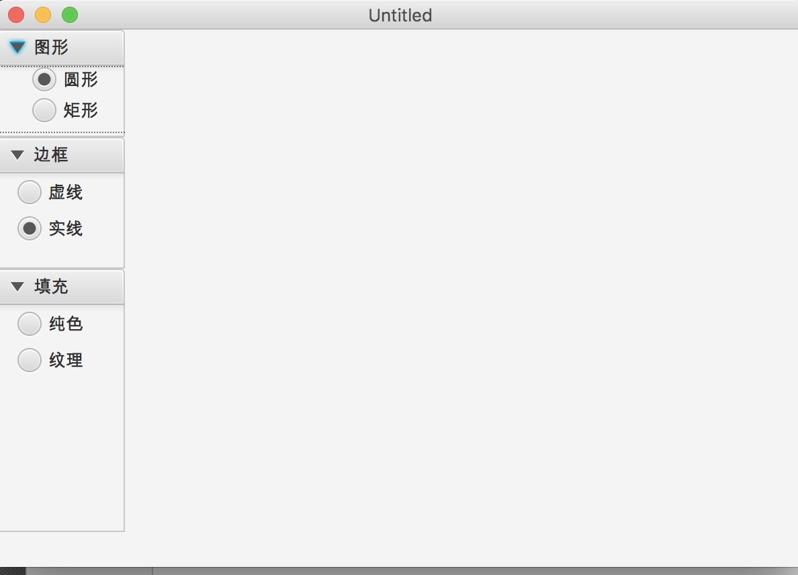

# 实验14

## 实验目的：

-   熟悉多线程编程

## 实验要求： 

-   按照题目要求写代码，并将工程文档压缩文件和实验报告上传到FTP。

## 实验题目：

1.  基本题目：

2.  请完成一个多线程的程序，实现五个线程同时向一个包含50个元素的数组中存储随机产生的1-6的整数。

3.  请完成一个多线程的程序，三个线程随机产生1-10的随机数放入一个包含10个元素的循环缓冲区，一个线程从里面取出元素并输出。其中循环缓冲区用自己定义的类。

4.  修改第2题，采用API中已有的类替换循环缓冲区类定义，并对程序做相应修改。

5.  (Bouncing Ball) Write a program that uses the JavaFX threading techniques to
    bounce a blue ball inside a Pane. The ball should begin moving in a random
    direction from the point where the user clicks the mouse. When the ball hits
    the edge of the Pane, it should bounce off the edge and continue in the
    opposite direction.

6.  (Bouncing Balls) Modify the program in exercise 4 to add a new ball each
    time the user clicks the mouse. Provide for a minimum of 20 balls. Randomly
    choose the color for each new ball.

# 实验15

## 实验目的：

-   熟悉多线程编程和网络编程

## 实验要求： 

-   按照题目要求写代码，并将工程文档压缩文件和实验报告上传到FTP

## 实验题目：

>   修改TicTacToe程序，补充“判断游戏结束”部分代码。
